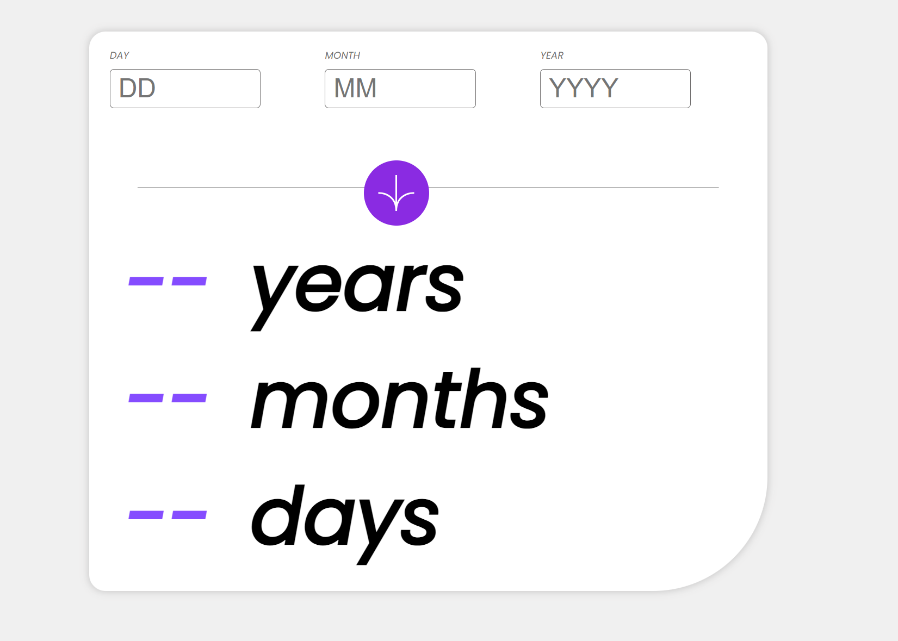
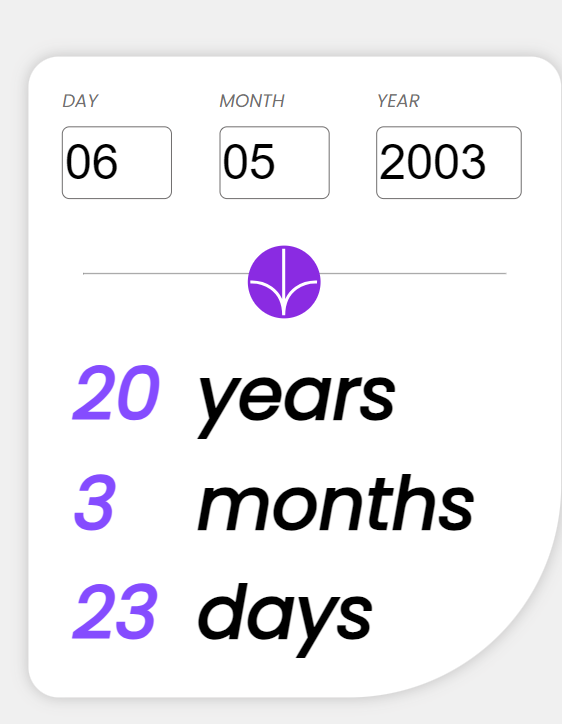

## Welcome! 👋

Thanks for checking out this front-end coding challenge.

## The challenge

Your challenge is to build out this age calculator app and get it looking as close to the design as possible.

You can use any tools you like to help you complete the challenge. So if you've got something you'd like to practice, feel free to give it a go.

Your users should be able to: 

- View an age in years, months, and days after submitting a valid date through the form
- Receive validation errors if:
  - Any field is empty when the form is submitted
  - The day number is not between 1-31
  - The month number is not between 1-12
  - The year is in the future
  - The date is invalid e.g. 31/04/1991 (there are 30 days in April)
- View the optimal layout for the interface depending on their device's screen size

**ScreenShot of my project/design**

**1) Home Page where a user can enter the age as day, month and year and after a click on the button in the middle it will generate the current age of the user**

**2) This one is the Mobile version design**

**Preview Site**

https://fynnschneider05.github.io/AgeCalculator/

**Have fun building!** 🚀